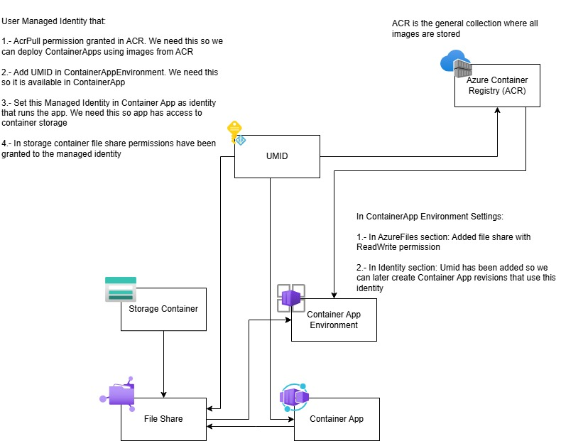

# Volume mounts
This is defined in `docker-compose.yml`. The web app will write files in this directory.
This is for local development, in Azure there is a Azure File Share configured

Note: when creating the image, `/log-files` was used, so it is referenced in Azure files as follows

# Local execution
## Build and run image
```
docker compose build
docker compose up
```

## Stop image
```
docker compose down
```

# Azure

## How to configure an environment of ContainerApp + FileShare



* First of all create a Managed Identity, this will act as the glue that sticks the differente moving pieces together.
* If an ACR is not already set up, configure one now. This is the image store to deploy as container apps.
* Grant AcrPull permission to the created managed identity. ACR used in this demo [here](https://portal.azure.com/#@axpogrp.onmicrosoft.com/resource/subscriptions/cb48ab12-d635-43e5-bd4e-b92bdba455e2/resourceGroups/general-purpose-resources/providers/Microsoft.ContainerRegistry/registries/ravicontainerimages/users).
* Create a new Container storage account, inside it, create a File share. To this new file share, assign 'Storage File Data SMB Share Contributor' role to the managed identity to be able to read/write files. This is set up [here](https://portal.azure.com/#view/Microsoft_Azure_FileStorage/FileShareMenuBlade/~/accesscontrol/storageAccountId/%2Fsubscriptions%2Fcb48ab12-d635-43e5-bd4e-b92bdba455e2%2FresourceGroups%2Fcontainerapps-with-containerstorage-demo%2Fproviders%2FMicrosoft.Storage%2FstorageAccounts%2Fstorage4logs4demo/path/storage4log4files4demo/protocol/SMB)
* The container storage account provides a secret key, we will need it, access [here](https://portal.azure.com/#@axpogrp.onmicrosoft.com/resource/subscriptions/cb48ab12-d635-43e5-bd4e-b92bdba455e2/resourceGroups/containerapps-with-containerstorage-demo/providers/Microsoft.Storage/storageAccounts/storage4logs4demo/keys)
* Create a blank ContainerApp. In this step select either a existing container app environment or create a new one (as part of creating the container app). Any way:
    * Add managed identity to container app environment to the available identities, as [here](https://portal.azure.com/#@axpogrp.onmicrosoft.com/resource/subscriptions/cb48ab12-d635-43e5-bd4e-b92bdba455e2/resourceGroups/containerapps-with-containerstorage-demo/providers/Microsoft.App/managedEnvironments/attached-storage-demo-environment/msi)
    * Add AzureFile that points to the file share created earlier, at this point we need the generated key mentioned, as [here](https://portal.azure.com/#@axpogrp.onmicrosoft.com/resource/subscriptions/cb48ab12-d635-43e5-bd4e-b92bdba455e2/resourceGroups/containerapps-with-containerstorage-demo/providers/Microsoft.App/managedEnvironments/attached-storage-demo-environment/azureFiles)
* Now finally configure the container app:
    * Under Settings/Identity add the managed identity in the user assigned tab. This step is not possible without configuring the identity in container app environment.
    * Under Application/Volumes add the fileshare configured for the container app environment. This step is not possible without configuring the storage in container app environment.
    * Under Application/RevisionsAndReplicas: Create a new revision, add a new App container where the managed identity is specified, the image from ACR and the volume where files are stored. Note that when configuring Volume Mount, a mounth path is required. This is the path the app uses, so it has to be correct

# Now the app should be up and running, files written by the app should be available in real time in the file share.